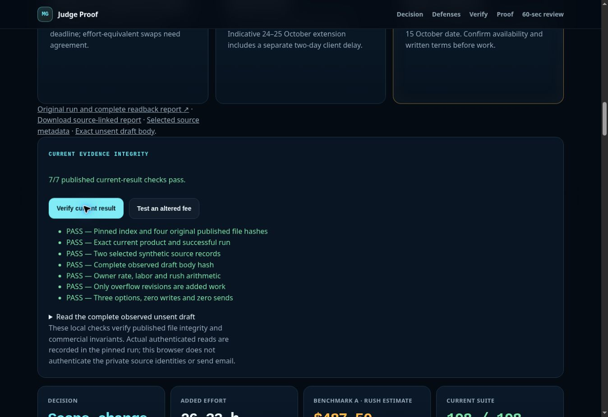

# Publication verification — 6 October 2026

The final English current-result view is live at https://trex2021.github.io/mermail-skills/. GitHub Pages deployment [37401789509](https://github.com/Trex2021/mermail-skills/actions/runs/37401789509) completed successfully from commit `18f5c434e075086a474dbee9980bf58b6be93f6b`.

The browser rendered the current-product scope ledger, three negotiation options and the exact complete preserved unsent draft. Clicking **Verify current result** showed **7/7 passed**: pinned checksum index and four original files; exact current product/run; two synthetic selected sources; observed draft-body hash; owner-grounded arithmetic; revision overflow; and three options with zero writes/sends. Clicking **Test an altered fee** rejected a simulated $100 base-fee edit with the arithmetic check failing. The valid result was restored to 7/7 afterward. These are published-file and commercial-invariant checks, not authentication of private email identities.

The existing historical proof verifier also rendered 11/11 passed for its explicitly archived `c7d1f75` bundle; it was not relabelled as current-product provenance.

Screenshot SHA-256: `918b907ae8afd213d4b86f7602fc189dff17481a57f385f40f1ff2aa7231fae1`.

[PR #124](https://github.com/Nudgen-Marketing/mermail-skills/pull/124) body was updated and exactly read back. Product head remains `c4876e43189c41771fcfa89f30d6cab400257654`; the PR remains open and mergeable. [Final English Superteam fields](https://github.com/Trex2021/mermail-skills/blob/65c1e729f2060f3689a83851c2d2e9f33ad09171/evaluation/pr124-review/FINAL-SUBMISSION.md) and [focused review guide](https://github.com/Trex2021/mermail-skills/blob/65c1e729f2060f3689a83851c2d2e9f33ad09171/evaluation/pr124-review/REVIEW-GUIDE.md) are preserved.

Superteam was visibly signed out (Login/Sign Up), so no entry form update or credential entry is claimed. Public rules currently show 215 submissions, 500 USDC total prizes and 11 October winner announcement; the sponsor comment states the deadline is 7 October 2026 at 13:59 UTC. Human review and five upstream workflow authorizations remain pending; the author connection has read-only upstream permissions. No new person-directed message, draft save, external send, wallet connection, payment, merge or permission change occurred.
